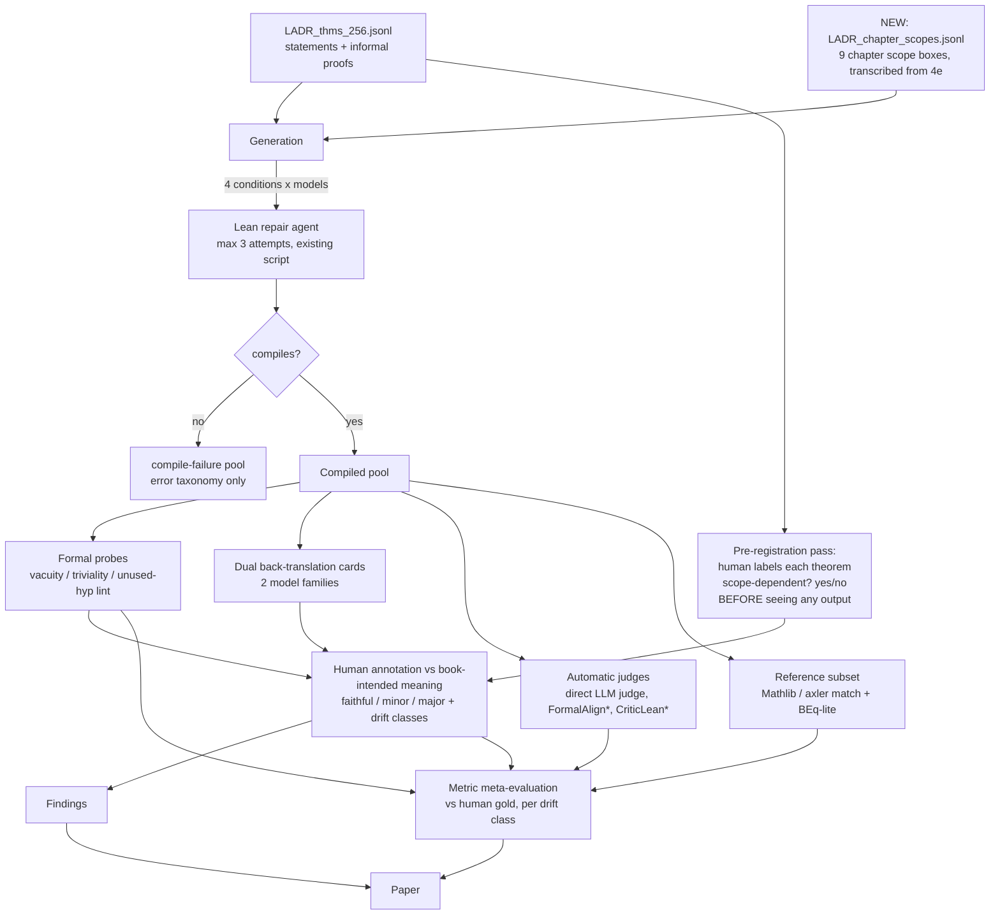
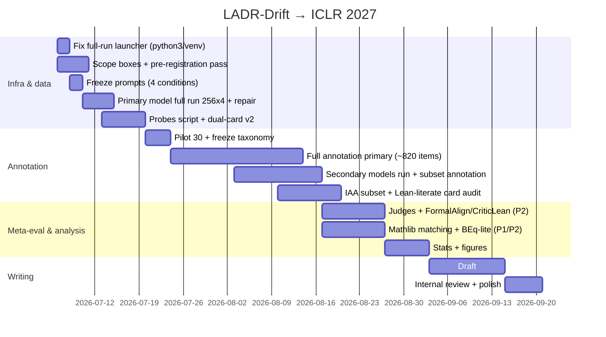

# Paper Plan — Semantic Drift in Textbook Autoformalization (LADR)

Status: planning frozen 2026-07-05. Target: ICLR 2027 (abstract ~mid-Sep, full ~late Sep 2026 — verify exact dates when announced; fallback: AAAI-27 second cycle / ACL 2027).

**How to use this document:** §0–§8 are the research design (read once); §9 is the task backlog; **Appendix A is the step-by-step execution runbook — to run the experiments, start there**; Appendix B is the glossary; Appendix C holds the prompt templates. Budget lives in `api_usage_proposal_2026-07-05.md`.

---

## 0. Working title and thesis

**Working title:** *Compiling Is Not Faithful: Measuring Semantic Drift in Textbook Autoformalization*
(benchmark name: **LADR-Drift**; alternates: "Faithful to What? Scope-Dependent …")

**One-paragraph thesis.** Autoformalization is usually evaluated on self-contained competition statements, where "faithfulness" has an unambiguous referent. Real mathematics lives in textbooks, where a theorem's meaning depends on *chapter scope* — standing assumptions declared once at the chapter head ("𝔽 denotes ℝ or ℂ", "V, W are finite-dimensional inner product spaces") and never repeated in the statements. We build the first human-audited testbed for this setting from *Linear Algebra Done Right* (4e): 256 theorems with aligned informal proofs and per-chapter scope boxes. We (1) quantify the gap between compiling and faithful, (2) test whether informal proofs and chapter scope — two kinds of context — reduce semantic drift, and (3) meta-evaluate existing automatic faithfulness metrics against our human gold labels, per drift class. Headline motivation: agentic pipelines can now formalize whole textbooks (130K LoC in a week); *trusting the statements* is the bottleneck.

**Research questions.**

- **RQ1 (gap):** Among generated Lean statements that compile, what fraction is unfaithful to the book-intended meaning, and with what taxonomy of drift?
- **RQ2 (context):** Does adding (a) the informal proof, (b) the chapter scope box improve *faithfulness* (we already know (a) does not improve *compilation*)? 2×2 factorial.
- **RQ3 (metrics):** Which automatic signals (formal probes, LLM judges, back-translation, trained scorers, reference-based equivalence) detect which drift classes, at what precision/recall/cost? Do metrics tuned on self-contained data go blind on scope drift?

**Pre-registered hypotheses** (any outcome is publishable — see §8):

- H1: informal proof does not improve compilation (replicates pilot at n=256).
- H2: informal proof improves faithfulness (proofs surface hidden definitions/edge conditions).
- H3: scope box improves faithfulness specifically on the scope-dependent stratum (ch. 6–9).
- H4: reference-free metrics (LLM judges) systematically miss scope drift, because the judge sees the same context-deprived statement the generator saw.

### 0.1 Takeaways (write these into the abstract's last sentence and the conclusion's first)

**If the reader remembers one sentence:** *"Faithful to what?" — textbook mathematics is not self-contained: a statement's meaning depends on chapter context, and the entire current evaluation chain (compile rate, LLM judges, trained alignment scorers) rests on the implicit assumption that statements are self-contained. That assumption fails systematically on real mathematical text.* "Compiles ≠ faithful" is the half the field already says; our increment is the referent problem, quantified on one coherent book with human gold labels and a 2×2 causal design.

**Three guaranteed takeaways (delivered regardless of how H1–H4 resolve):**

- **T1 — a discount factor and a vocabulary** (for anyone reporting typecheck rates): "X% of compiling textbook formalizations are unfaithful to the book-intended meaning; Y% of failures are scope drift." First human-audited number in the textbook setting; the drift taxonomy gives these errors citable names.
- **T2 — is context cheap alignment fuel?** (for formalizer builders): every cell of the §8 outcome matrix is an action. Scope helps → feeding chapter conventions is a zero-cost improvement every textbook pipeline should adopt; proof helps → don't strip informal proofs from data pipelines; neither helps → drift is a decoding-prior problem, prompting can't fix it, and detection (T3) inherits the importance.
- **T3 — the auditor shares the blind spot of the audited** (the sharpest one, aimed at the evaluation paradigm): if H4 holds, an LLM judge shown the same context-deprived statement as the generator *cannot in principle* detect scope drift — a structural critique of judge-filtered pipelines (FormalMATH-style filtering, MathAtlas-scale judging). We deliver the first signal × drift-class detection map with costs, a practical cascade (probes → dual-card judge → human), and the cheap fix (give the judge the scope box). If H4 fails, the takeaway inverts cleanly: judges suffice and the human tier of the cascade can be dropped.

**Per audience:** autoformalization builders — stop reporting typecheck alone; audit with the cascade; keep scope context in training data. Mass-formalization efforts (30K-agent textbook runs) — throughput is no longer the bottleneck, statement trust is; this paper calibrates the audit toolbox. Benchmark builders — hand-decontextualized statement sets (ProofNet/miniF2F style) overestimate real-text capability; LADR-Drift is the contextual control.

**Positioning honesty:** this is a measurement paper. The claim is not "we formalize better" — it is "we change how the field measures *better*, and ship an audit pipeline you can use today." One under-articulated concept (the referent problem) + one clean design (2×2, pre-registered) + one reusable resource (gold-labeled LADR-Drift).

---

## 1. Why LADR, why this team (positioning)

### 1.1 Evidence that LADR is the right instrument

Per-chapter counts from `LADR_thms_256.jsonl` (how often statements *explicitly* carry their assumptions):

| chap | #thm | says "finite-dimensional" | says "inner product" | mentions 𝔽 | mentions V |
|---:|---:|---:|---:|---:|---:|
| 1 | 10 | 0 | 0 | 3 | 6 |
| 2 | 14 | 10 | 0 | 0 | 7 |
| 3 | 49 | 17 | 0 | 2 | 35 |
| 4 | 9 | 0 | 0 | 0 | 0 |
| 5 | 30 | 18 | 0 | 9 | 26 |
| 6 | 29 | 16 | 3 | 4 | 26 |
| 7 | 43 | **1** | 5 | 10 | 38 |
| 8 | 28 | 0 | 1 | 13 | 27 |
| 9 | 44 | 0 | 8 | 11 | 36 |

Chapter 7 declares V, W to be finite-dimensional inner product spaces *in the chapter head only*: 43 theorems, one explicit mention. E.g. `LADR_thm_chap_7_4` = "If T ∈ L(V,W), then T\* ∈ L(W,V)" is not even well-posed without the scope box. Meanwhile ch. 2/5 mostly restate assumptions → a natural **scope-dependence gradient** across chapters, giving within-book contrast for free.

### 1.2 Positioning vs. existing work (cite all; differentiate explicitly)

| Work | What it is | Why we're different |
|---|---|---|
| FormalAlign (ICLR'25), CriticLean | trained alignment scorers | we don't train a scorer; we meta-evaluate scorers against human gold on context-dependent data |
| GTED, BEq/BEq+ | reference-based metrics | need a gold formal reference; we use them only on the Mathlib-matched subset, as baselines |
| LeanScorer (Mathesis), FormalMATH multi-LLM judge | reference-free judging pipelines | evaluated on self-contained (Gaokao/competition) statements; we test them under scope dependence |
| FormalMATH hypothesis rejection / negation disproof | formal sanity filters | we adopt these as probes and report their per-drift-class coverage |
| MathAtlas (2026) | 52k items, 103 graduate books, LLM-judged | scale vs. depth: we offer *human-audited* labels, paired 2×2 context conditions, drift taxonomy |
| LCS-Bench (2026) | notes implicit-assumption problem in a logic textbook | we make scope the *manipulated variable*, in undergraduate math, with quantified effects |
| Automatic Textbook Formalization (2026, 30K agents) | mass proof production | motivation citation: statement trust is now the bottleneck |

**Our contributions (claim list for the paper):**
1. LADR-Drift: 256 textbook theorems + informal proofs + per-chapter scope boxes + pre-registered scope-dependence labels + ~1.2k human faithfulness verdicts with drift taxonomy over model outputs (released).
2. First quantification of compile-vs-faithful gap under textbook scope, with a 2×2 causal test of proof/scope context (paired, McNemar).
3. Meta-evaluation of automatic faithfulness signals per drift class + a practical detection cascade; evidence for/against H4.

### 1.3 Annotator qualification & trust chain (preempt the obvious review)

The annotator reads mathematics fluently but not Lean. This is by design — the entire measurement chain is built so that **no step requires a human to read Lean**:

1. **Dual back-translation cards.** Two *different* model families independently back-translate each compiled Lean statement into a structured math card (objects, hypotheses, conclusion, quantifiers), under a "do not silently repair" prompt (already implemented). Cards disagreeing → item flagged for extra scrutiny.
2. **Formal probes** (Lean-side, fully automatic, no reading): see §4.1.
3. **Lean-literate audit.** A Lean-fluent colleague audits ~40 randomly sampled cards *against the raw Lean* to estimate the card channel's error rate; this number goes in the paper. (Recruit via advisor/Lean Zulip; this is the only external dependency.)
4. **Reference-based subset.** Where the theorem has a known Mathlib/`arienmalec/axler` counterpart, machine equivalence checks bypass humans entirely.

If the card-channel error rate comes back high, fallback: annotate only items where both cards agree (report coverage), and expand the Lean-literate audit.

---

## 2. Study design



\* = if compute allows (needs GPU); cascade still complete without them.

### 2.1 Conditions (2×2, per theorem, per model)

The two context factors, defined once:

- **P = the textbook's informal proof** — the natural-language proof printed in LADR for this theorem, i.e. the `informal_proof` field of `LADR_thms_256.jsonl`. *Never* a Lean proof; the model is instructed to use it only to disambiguate the statement's intended meaning, not to translate it.
- **C = the chapter scope box** — the standing assumptions declared at the head of the theorem's chapter ("𝔽 denotes ℝ or ℂ", "V, W are finite-dimensional inner product spaces", …), transcribed into `LADR_chapter_scopes.jsonl`.

| condition | prompt contains | exists already? |
|---|---|---|
| `SO`  | statement only | yes (pilot) |
| `SP`  | statement + informal proof | yes (pilot) |
| `SC`  | statement + chapter scope box | **new** |
| `SPC` | statement + informal proof + chapter scope box | **new** |

Same generation prompt family + same repair agent (max 3 attempts) for all four. Freeze prompts before the full run; version them (`ladr_statement_v3_{so,sp,sc,spc}`).

### 2.2 Models

- **Primary (full 256 × 4):** GPT-5.4, thinking off (wired up already; pilot-validated).
- **Secondaries (stratified 64-theorem subset × 4, each):** GPT-5.5 (thinking on — its default; gives a same-vendor ±thinking contrast: does test-time reasoning improve faithfulness?), Claude Opus 4.8 (thinking off, cross-vendor frontier), Kimina-Autoformalizer-7B + one more open 7B formalizer (Mathesis- or StepFun-Formalizer, pick at setup per HF availability). Subset stratified by chapter and by pre-registered scope-dependence.
- **Measurement models (not under test):** Claude Sonnet 5 = judge family B + card channel B; Haiku 4.5 = card-diff judge; GPT-5.4 doubles as judge family A + card channel A. Every output is judged by both vendor families (self-preference control).
- Budget: authoritative line items in `api_usage_proposal_2026-07-05.md`. Annotation is the real cost, not tokens — see §3/§7.

### 2.3 Data artifacts to build (Week 1)

1. `LADR_chapter_scopes.jsonl` — one row per chapter: `{chapter, scope_nl}` transcribed verbatim from the 4e chapter-head boxes (~1–2 h; the book is open access, cite text under CC BY-NC).
2. `LADR_scope_dependence_256.jsonl` — pre-registration pass (§2 flowchart): for each theorem, `scope_dependent ∈ {yes, no, unsure}` + which scope facts are needed (𝔽=ℝ/ℂ, fin-dim, inner-product, nonzero, complex). Done by reading statement + scope box only, before any model output exists. ~4–5 h. This is a first-class released artifact.

---

## 3. Annotation protocol (the core labor — freeze before scaling)

**Unit:** one compiled Lean statement (theorem × condition × model). **Gold referent:** the *book-intended* meaning = statement ⊕ chapter scope ⊕ book definitions.

**Labels per item:**
- `faithfulness ∈ {faithful, minor_drift, major_drift}` w.r.t. book-intended meaning.
  - *minor:* meaning-preserving modulo benign generalization (e.g. true-and-standard over any field when book says 𝔽 — call benign iff the book statement is a literal instance of the Lean statement AND no scope fact is load-bearing).
  - *major:* provably different claim — dropped/added load-bearing hypothesis, changed objects, changed quantifiers, vacuous, wrong definition.
- `drift_classes ⊆` taxonomy below (multi-label).
- `caught_by ∈ {card_A, card_B, card_disagreement, probe, direct}` — provenance, feeds RQ3.
- `confidence ∈ {high, low}`.

**Drift taxonomy (v1 — refine on 30-item pilot, then freeze):**

| class | definition | seed example from pilot |
|---|---|---|
| `scope_field` | 𝔽 (=ℝ or ℂ) generalized/instantiated wrongly | `chap_1_14`: arbitrary `Field 𝕜` for 𝔽ⁿ commutativity (benign→minor) |
| `scope_findim` | finite-dimensionality from chapter head lost | expected dominant in ch. 7–9 |
| `scope_structure` | inner-product/complex/nonzero structure lost | ch. 6–9 |
| `def_mismatch` | book definition ≠ Mathlib definition used | `chap_7_82`: operator norm via `sSup` + added `CompleteSpace` |
| `hyp_drift` | non-scope hypothesis dropped/added/strengthened | — |
| `concl_drift` | conclusion object/relation changed | — |
| `quantifier` | ∀/∃ scope or order changed | — |
| `vacuous_trivial` | hypotheses contradictory, or content-free | probe-detectable |

**Procedure:** pilot-annotate 30 items → revise taxonomy/guidelines → freeze → full pass. Re-annotate a random 10% two weeks later (intra-annotator consistency, report κ). Second annotator (any math grad student) labels a 50-item subset for inter-annotator κ. All via the existing HTML comparison page (extend it with a label form + JSONL export; ~half-day of tooling).

**Volume & time budget** (at ~3 min/item, ~80% compile rate):
- Primary model: 1,024 gens → ~820 compiled → **~41 h**, all 4 conditions.
- Secondaries (4 models × 256 gens): annotate the `SO`+`SPC` corner cells first (~410 compiled ≈ **20 h** guaranteed); `SP`/`SC` cells are stretch — generated anyway (API cost negligible) and archived, annotated only if ahead of schedule.
- Pre-registration pass ~5 h; pilots/calibration ~4 h. **Total guaranteed scope ≈ 70 h ≈ 3.5 weeks at 20 h/wk.** This is the critical path; guard it.

---

## 4. Automatic signals (for RQ3 meta-evaluation)

### 4.1 Formal probes (cheap, Lean-native, no human)

Reuse the existing `lake env lean` checker; one new script that, per compiled statement, tries:

1. **Vacuity / hypothesis rejection:** state `hypotheses → False`, attempt `exact?`/`aesop`/`simp_all`/`omega`. Success ⇒ unfaithful (FormalMATH-style).
2. **Hypothesis-independence:** delete all hypotheses, re-attempt the conclusion; provable ⇒ hypotheses inert ⇒ suspicious.
3. **Unused-argument lint:** `#lint` unusedArguments-style checks on the statement.
4. **Counterexample search:** `plausible` where instances are decidable (expect low coverage on abstract typeclass statements — *the coverage number is itself a finding*).

Caution: "provable outright by `exact?`" does NOT imply unfaithful — most LADR theorems literally exist in Mathlib. Triviality probes must be hypothesis-relative, not provability-based.

### 4.2 Reference-free judges

- Direct LLM judge (NL vs Lean), 2 model families, fixed rubric, **two context settings each**: judge sees statement only vs. statement + scope box (this is the H4 manipulation).
- Dual back-translation cards + LLM comparison verdict (pipeline exists; add a second back-translator model + a card-vs-card diff judge).
- FormalAlign checkpoint / CriticLean-32B — *P2, only if GPU rental is easy*; not load-bearing.

### 4.3 Reference-based (matched subset only)

- Match LADR theorems to Mathlib or `arienmalec/axler` declarations (LeanSearch/loogle + manual confirm via cards). Expect good coverage on ch. 1–3 + named theorems later.
- **BEq-lite:** attempt `exact?`-powered proof of generated ↔ reference in both directions. Report on the matched subset. *P1/P2 — the paper stands without it.*

### 4.4 Meta-evaluation outputs

Per signal: precision/recall/F1 against human gold, overall AND per drift class AND per stratum (scope-dependent vs self-contained), plus $/item cost. Deliverable figure: signal × drift-class heatmap. Deliverable table: recommended cascade (probes → dual-card judge → human) with achieved recall at fixed audit budget.

---

## 5. Analysis & statistics plan

- **RQ1:** faithful-rate among compiled, by chapter and by stratum, with 95% Wilson CIs. Headline: "X% of compiling textbook formalizations are unfaithful; Y% of failures are scope drift."
- **RQ2:** paired McNemar tests: SO vs SP (informal-proof effect), SO vs SC (scope effect), SP vs SPC, on (i) compile, (ii) faithful-given-compiled, (iii) end-to-end faithful-and-compiled. Report effect sizes + discordant-pair counts, overall and on the scope-dependent stratum (pre-registered primary endpoint: SC−SO on that stratum). n=256 pairs resolves ~8–10 pp asymmetries — adequate.
- **RQ3:** per-signal PR curves where scores are continuous; per-class recall matrix; judge-with-scope vs judge-without-scope contrast (H4).
- Figures planned: (F1) compile vs faithful bars per condition; (F2) drift-class distribution per chapter (stacked); (F3) signal × class heatmap; (F4) per-chapter scope-dependence gradient vs drift rate scatter.

---

## 6. Paper skeleton (8 pages + appendix)

1. **Intro** — textbook formalization is scaling (30K-agent citation); compile ≠ faithful; faithfulness has a *referent* problem: faithful to what? Contributions C1–C3.
2. **Related work** — metrics (FormalAlign, GTED, BEq+, LeanScorer, CriticLean), benchmarks (ProofNet, FormalMATH, MathAtlas, LCS-Bench), filters (hypothesis rejection). Position via §1.2 table.
3. **LADR-Drift testbed** — data, scope boxes, scope-dependence pre-registration, Table 1 = per-chapter table above.
4. **Study design** — 2×2 conditions, models, repair agent, trust chain (fig), annotation protocol + κ's.
5. **Results I: the gap & the taxonomy** (RQ1; F1, F2).
6. **Results II: does context help?** (RQ2; McNemar table; per-stratum).
7. **Results III: can machines catch drift?** (RQ3; F3; cascade table; H4 result).
8. **Discussion & limitations** — one book, one annotator (mitigated by κ + audit), statement-level only, benign-generalization judgment calls.
9. **Appendix** — full taxonomy guidelines, prompts, card schema, per-item release, license note (LADR 4e is Springer open access CC BY-NC — release derived text non-commercially with attribution).

---

## 7. Timeline (11 weeks: Jul 6 → Sep 21, submission buffer to late Sep)



Weekly effort: ~20 h/wk annotation-dominated in weeks 3–6. If >1 week behind by Aug 10: cut secondary models to `SO`+`SPC`, drop BEq-lite and trained scorers to future work — **the P0 core (primary model 2×2 + human gold + probes + judges) is a complete paper.**

---

## 8. Outcome matrix (why no result kills the paper)

| | scope helps | scope doesn't help |
|---|---|---|
| **proof helps** | context is cheap alignment fuel; taxonomy says which kind | proofs disambiguate definitions, scope must be resolved another way |
| **proof doesn't help** | scope boxes are the missing input; proofs are for provers, not formalizers (extends pilot) | *both* contexts fail ⇒ drift is a decoding-prior problem; metrics section becomes the headline |

Plus RQ1 (the gap number + taxonomy) and RQ3 (the heatmap + cascade) are unconditional contributions.

---

## 9. Task backlog

**P0 — must (paper core)**
- [ ] Fix launcher: `nohup python3 …` (or `source .venv/bin/activate` first); add `caffeinate -i`; smoke-test on 3 theorems. (Current `full256_statement_only.log` shows the July 1 run never started: `nohup: python: No such file or directory`.)
- [ ] Pin API client config in all three scripts: `OpenAI(timeout=<explicit>, max_retries=0)`; **Anthropic measurement calls (Sonnet 5) explicitly `thinking: {"type": "disabled"}`** — its default is adaptive-ON and would silently burn reasoning tokens; log model + thinking/effort setting into each output record; smoke-test 3–5 items and verify R (`usage.output_tokens`) before every full run (see §10 billing-trap rules).
- [ ] Transcribe `LADR_chapter_scopes.jsonl` (9 chapters, verbatim boxes).
- [ ] Pre-registration pass → `LADR_scope_dependence_256.jsonl` (before any new generation output is inspected).
- [ ] Add scoped-condition experiment scripts; freeze 4 prompts; bump prompt version.
- [ ] Full primary run: archive artifacts under `results/<condition>/<model>/`.
- [ ] Probes script (`probe_compiled_statements.py`): vacuity, hypothesis-independence, unused-arg lint; JSONL out.
- [ ] Second back-translator model + card-diff judge; regenerate cards for all compiled outputs.
- [ ] Extend HTML comparison page with label form → JSONL export.
- [ ] Pilot-30 annotation → freeze taxonomy v1.1 + guidelines doc.
- [ ] Full annotation (primary model). 10% re-annotation for intra-κ.
- [ ] Direct LLM judge ×2 families × {with, without scope} (H4).
- [ ] Stats notebook: Wilson CIs, McNemar, strata; figures F1–F4.
- [ ] Write paper.

**P1 — should**
- [ ] Secondary models (Claude + open formalizer) on stratified 64-subset ×4.
- [ ] Second annotator 50-item IAA; Lean-literate audit of 40 cards.
- [ ] Mathlib/axler matching for reference subset.
- [ ] Compile-failure error taxonomy refresh at n=256 (replicates pilot H1).

**P2 — stretch**
- [ ] BEq-lite bidirectional `exact?` on matched subset.
- [ ] FormalAlign / CriticLean-32B scoring (GPU rental).
- [ ] Mutation stress-test: controlled unfaithful variants (FormalAlign-style) to sanity-check the cascade.
- [ ] Cumulative-context ablation (chapter defs retrieval) — appendix only.

**Out of scope (guardrails — do not drift):** proof generation/repair research, training any model or scorer, formalizing LADR ourselves, other textbooks, exercises_733 (future work), agentic formalization frameworks.

---

## 10. Budget (estimated 2026-07-05; verify prices before large runs)

**Basis — measured from the gpt-5.4 pilot (actual `usage` fields):** one-shot ≈ 429 in / 142 out; repair pipeline ≈ 2.13 attempts/item × (610 in / 155 out); back-translation card ≈ 1,009 in / 518 out; informal proof adds ~220 in, scope box ~80 in. Working per-item figure (generation, avg over 4 conditions): **~1,650 in / ~350 out**.

**Prices** (per MTok): GPT-5.4 $2.50/$15 ([OpenAI pricing](https://developers.openai.com/api/docs/pricing)); Claude Sonnet 5 $3/$15 — intro $2/$10 through 2026-08-31, which covers our whole run window; Claude Opus 4.8 $5/$25; Claude Haiku 4.5 $1/$5. Both OpenAI and Anthropic batch APIs give **50% off** — our pipeline is batchable per repair round (generate round k for all theorems → compile locally → batch round k+1 for failures).

**Authoritative line-item budget: `api_usage_proposal_2026-07-05.md`** (final 5-generator lineup: GPT-5.4 primary; GPT-5.5, Opus 4.8, 2 open 7B formalizers secondary; Sonnet 5 + Haiku 4.5 on measurement). Headline: **expected ≈ $200–230 with cost-control policy enforced; requested cap $650** (cap sized to survive partial policy slippage — an undisciplined run of the same experiment plausibly costs $600–700). Spend gates, per-phase sequencing, and the pre-declared cut order live in proposal §4/§7. The unit economics and cost-control rules below remain the working reference.

Notes:
- GPU rates: RunPod community RTX 4090 ≈ $0.34/hr, A100 80GB ≈ $1.39–2.19/hr ([RunPod pricing](https://www.runpod.io/pricing)). Kimina-7B fits a 4090 with vLLM; CriticLean-32B needs A100-80GB (4-bit) or 2×.
- **Thinking defaults decide the budget (hard-won lesson from the FEM project — do not repeat it here):**
  - GPT-5.4 defaults to thinking OFF → pilot's ~150 out tok/call; the table above is valid **only under this config**.
  - GPT-5.5 defaults to thinking ON (medium): measured R ≈ 8.5k–16.6k completion tokens/call (max seen 31k) at $5/$30 per MTok → **$0.25–0.50/call**, ~55 tok/s → 2.5–5 min/call. Reasoning tokens are invisible in output but fully billed.
  - **Smoke-test rule:** before ANY model/effort change, run 3–5 representative items, read `usage.output_tokens` → R; per-call ≈ R × output-price + input × input-price; total ≈ #calls × per-call × 1.25. Never budget from intuition.
- **Billing trap — client timeout + retry vs reasoning models.** Killing the local process does NOT stop server-side generation; the request completes and bills in full, and the calls that time out are precisely the most expensive ones — retrying re-buys the most expensive item at full price and throws it away (~$200 of the FEM project's ~$500 went to this). OpenAI docs give no billing guarantee for sync disconnects; the only documented cancel path is `background: true` + `responses.cancel` (requires `store=true`). **Our scripts currently pass no client config → SDK defaults are timeout 600 s + `max_retries=2` (automatic!)** — harmless with 5.4-thinking-off (calls take seconds), a live landmine with any thinking model. Rules:
  1. Sync runs: construct the client with explicit long timeout and `max_retries=0`.
  2. Prefer the Batch API — immune to the trap by design, and 50% off.
  3. Long single calls that must be cancellable: `background=true` + poll + `responses.cancel`.
- Judges (C+D) dominate cost — batch them; card/judge tasks don't need thinking, keep effort none/low there.
- Probes wall-clock is the hidden cost: ~5k `lake env lean` checks × ~30 s ≈ 40 CPU-hours on the Mac — run overnight with N parallel workers, budget 3–5 nights.
- Rate limits: total volume is a few MTok per provider — entry tiers suffice, no upgrades needed.

## 11. Risks & mitigations

| risk | likelihood | mitigation |
|---|---|---|
| Annotation overruns (the critical path) | high | volume math in §3; cut order pre-declared in §7 |
| Card channel unreliable (silent repair) | medium | dual cards + disagreement flags + Lean-literate audit; report channel error rate |
| "n=256 too small" review | medium | depth-vs-scale positioning vs MathAtlas; paired design; human gold; per-class analysis impossible at 52k |
| Repair agent compile rate collapses on ch. 8–9 | medium | acceptable — compile-failure pool still feeds H1/error taxonomy; report coverage honestly |
| Benign-generalization boundary contested | medium | explicit rule in §3 (literal-instance test); release all judgments for audit |
| Single primary model | low | secondary subset (P1); framing is about the *evaluation problem*, not model ranking |
| LADR licensing | low | 4e is open access CC BY-NC; attribute, non-commercial, cite Axler |

---

## Appendix A — Execution runbook (self-contained; do the steps in order)

Every step lists: command(s), where output lands, a done-check, and estimated time. All commands run from the repo root with the venv active (`source .venv/bin/activate`; create via `python3 -m venv .venv && pip install -r requirements.txt` if absent). API keys live in `.env` (`OPENAI_API_KEY`; add `ANTHROPIC_API_KEY` before Step 6).

> ⚠️ **Model-default landmine (read before running anything):** `statement_only.py` / `statement_plus_proof.py` and `legacy_repair_agent.py` currently default to `--model gpt-5.5` (changed 2026-07-01). GPT-5.5 has thinking ON by default; an accidental no-flag full run = 5.5 × 16k max-tokens × SDK auto-retries — the exact cost trap in §10. **Either flip the defaults back to `gpt-5.4` in Step A1, or never invoke without an explicit `--model`.**

### A0. Prerequisites (once, ~1 h)
- `python3 --version` (3.10+), venv + `pip install -r requirements.txt`.
- Lean toolchain: `cd lean_checker && lake env lean --version` succeeds (mathlib already built; if not, `lake exe cache get && lake build`, ~30–60 min).
- `.env` contains `OPENAI_API_KEY`; RunPod account only needed at Step A8.

### A1. Harden the scripts (P0, ~1–2 h)
1. In all three API scripts, construct the client explicitly: `OpenAI(timeout=900, max_retries=0)` (and later `Anthropic(..., max_retries=0)`).
2. Flip `--model` defaults in `statement_only.py` / `statement_plus_proof.py` / `legacy_repair_agent.py` back to `gpt-5.4` (or make the flag required).
3. Add to every output record: `model`, `thinking/effort setting`, `prompt_version`.
4. Launcher pattern for long runs: `caffeinate -i nohup python3 scripts/legacy_repair_agent.py ... > logs/<run>.log 2>&1 &` (the July-1 failure was `nohup python` → command not found; log stays 41 bytes).
- **Done-check:** `--dry-run --limit 3` prints resolved model + config; a 3-item live smoke shows `usage` with no unexpected reasoning tokens.

### A2. Data prep (before looking at any new model output; ~6 h reading work)
1. **Scope boxes** → `LADR_all_material/LADR_chapter_scopes.jsonl`, one row `{chapter, scope_nl, source}`. Source: the standing-assumptions/notation box at each chapter opening of LADR 4e (free PDF at Axler's site). Ch. 1 has no box — record the in-text conventions of 1A/1B (𝔽 = ℝ or ℂ) instead.
2. **Pre-registration pass** → `LADR_all_material/LADR_scope_dependence_256.jsonl`, one row `{name, scope_dependent: yes|no|unsure, needed_facts: [fin_dim | field_RC | inner_product | complex | nonzero | ...]}`. Decision rule: `yes` iff the statement's mathematical meaning changes **or becomes ill-posed** when read without the chapter box (e.g. `LADR_thm_chap_7_4`: T* undefined without the inner-product/fin-dim scope → yes). Do this from statement + box ONLY — no model outputs on screen.
3. **Stratified 64-subset** → `LADR_all_material/LADR_subset_64.jsonl`: stratify by chapter × scope_dependent; fix the seed; commit the file so all secondary models use the identical subset.
- **Done-check:** 9 scope rows; 256 dependence rows; 64-subset committed. Git-commit all three before Step A4 (timestamped pre-registration).

### A3. Add SC/SPC conditions (~2–3 h)
- Extend `CONDITIONS` and the prompt builder in `statement_only.py` + `statement_plus_proof.py` + `legacy_repair_agent.py` using the Appendix C blocks; scope text loaded from `LADR_chapter_scopes.jsonl` by chapter parsed from `name`. Bump `prompt_version` to `..._v3`.
- **Done-check:** `--dry-run` for each of the 4 conditions shows the correct blocks present/absent.

### A4. Phase-0 smoke tests (mandatory gate, <$5)
- Per model/config: `python3 scripts/legacy_repair_agent.py --model <M> --condition SPC --limit 5 --input LADR_all_material/LADR_thms_256.jsonl --output <smoke_out>`; record mean R = `usage.output_tokens`.
- **Gate:** GPT-5.5 R > 10k → invoke proposal cut order (2 conditions only) before its full subset run.

### A5. Primary run — GPT-5.4, 256 × 4 (W1–2; ~2–6 h wall-clock/condition sequential + Lean checks)
```
for COND in SO SP SC SPC:
  caffeinate -i nohup python3 scripts/legacy_repair_agent.py \
    --model gpt-5.4 --condition $COND --max-iters 3 \
    --input  LADR_all_material/LADR_thms_256.jsonl \
    --output results/repair_agent_ab/gpt-5.4/reasoning_none/agent_${COND}.jsonl \
    > logs/full256_${COND}.log 2>&1
```
- Then error taxonomy: `python3 scripts/analyze_lean_checks.py --input .../agent_<COND>.jsonl`.
- **Done-check:** 256 rows per condition; compile rate in the ~70–90% band (pilot: 85% SO / 74% SP after repair). Big deviation → stop, diagnose prompts before spending more.

### A6. Measurement layer on primary (W2–3)
1. **Cards channel A (GPT-5.4):** `python3 scripts/backtranslate_lean_statements.py --root .../full_256_thms --model gpt-5.4` (compiled-only is the default).
2. **Cards channel B (Sonnet 5):** small port of the backtranslate script to the Anthropic SDK — pin `thinking: {"type": "disabled"}`; same card JSON schema (`ladr_backtranslation_card_v1`).
3. **Probes (new `scripts/probe_compiled_statements.py`):** our generation prompt already enforces the single-declaration shape `theorem NAME <binders> : CONCL := by sorry`, so probes rewrite textually at the last top-level `:`:
   - *vacuity:* replace `CONCL` with `False`, try `by simp_all`, `by exact?`, `by aesop` (any success ⇒ contradictory hypotheses);
   - *hypothesis-independence:* drop Prop-typed binders (keep types/instances), try `by exact?` on `CONCL` (success ⇒ hypotheses inert);
   - statements that fail to parse into this shape are skipped and **counted** (probe coverage is itself a reported number). Reuses the `lake env lean --stdin --json` checker; run overnight with 4–8 workers.
4. **Card-diff judge (Haiku 4.5)** + regenerate the comparison HTML: `python3 scripts/build_pilot_comparison_html.py --root ... --cards ...` (extend with the label form + JSONL export first).
- **Done-check:** every compiled statement has 2 cards + probe row + diff verdict; HTML opens locally with label buttons.

### A7. Annotation (W3–5, the critical path, ~45 h primary + ~20 h secondaries)
- 30-item calibration pilot → freeze taxonomy v1.1 (§3) → full pass on primary (all 4 conditions) → secondaries SO+SPC first.
- Labels append to `annotations/labels_<annotator>.jsonl` via the HTML form; 10% re-annotation after 2 weeks (intra-κ); 50-item second-annotator set (inter-κ); 40-card Lean-literate audit runs in parallel (§1.3).

### A8. Secondary models (W4–5)
- **Opus 4.8:** same repair-agent commands, `--model claude-opus-4-8` via the Anthropic port, thinking off, `--input LADR_subset_64.jsonl`.
- **GPT-5.5:** batch-only (per §10/proposal §7): per repair round, submit all pending items as one OpenAI Batch, poll, compile locally, next round.
- **Open models:** RunPod 4090, vLLM serving Kimina-Autoformalizer-7B (+ Mathesis/StepFun — pin exact HF ids at setup); point the scripts' `base_url` at the vLLM endpoint (OpenAI-compatible).
- **Done-check:** 4 models × 256 rows each; measurement layer (A6) re-run over their compiled outputs.

### A9. Direct judges (W5–6)
- New `scripts/judge_faithfulness.py`: 2 families (GPT-5.4, Sonnet 5 thinking-off) × 2 settings ({with, without scope box}) × every compiled+annotated statement; prompt + JSON schema in Appendix C. Batch API.

### A10. Analysis & writing (W6–9)
- Stats notebook per §5 (Wilson CIs, McNemar on discordant pairs, strata by pre-registered scope-dependence); figures F1–F4; paper per §6 skeleton; internal review W10.

## Appendix B — Glossary

| Term | Meaning |
|---|---|
| `SO` / `SP` / `SC` / `SPC` | Prompt conditions: Statement Only / + informal Proof / + Chapter scope / + both (§2.1) |
| informal proof | The textbook's natural-language proof (`informal_proof` field). Never a Lean proof. |
| scope box | Chapter-head standing assumptions of LADR 4e, transcribed to `LADR_chapter_scopes.jsonl` |
| pre-registration pass | Labeling each theorem scope-dependent/not *before* seeing any model output (bias control) |
| card | Structured math-language summary of a generated Lean statement (back-translation), the annotator's reading interface |
| card-diff | Automatic comparison verdict between the two channels' cards; disagreement flags an item for extra scrutiny |
| probe | Mechanical Lean-side check on a compiled statement (vacuity, hypothesis-independence) |
| R | Mean billed output tokens per call incl. hidden reasoning (`usage.output_tokens`), measured in smoke tests |
| drift classes | `scope_field`, `scope_findim`, `scope_structure`, `def_mismatch`, `hyp_drift`, `concl_drift`, `quantifier`, `vacuous_trivial` (§3) |
| BEq-lite | Bidirectional `exact?` equivalence attempt against a matched Mathlib/axler reference (P2) |
| κ (kappa) | Cohen's kappa: intra-annotator (10% re-annotation) and inter-annotator (50-item second labeler) agreement |

## Appendix C — Prompt templates v3 (draft; freeze at A3)

**C1. Scope block** (SC/SPC; inserted before the theorem):
```
CHAPTER CONVENTIONS (standing assumptions in force for this theorem; read the
statement under these conventions):
<scope_nl>
```

**C2. Informal-proof block** (SP/SPC; inserted after the theorem):
```
INFORMAL PROOF (the textbook's natural-language proof. Use it ONLY to
disambiguate what the statement means — which objects, which hypotheses,
which definitions. Do NOT translate the proof; output a statement ending
in `:= by sorry`.):
<informal_proof>
```

**C3. Direct-judge prompt** (both families, thinking off; `{±scope}` = include/omit the scope block):
```
You are auditing a Lean 4 formalization of a textbook theorem.
[CHAPTER CONVENTIONS: <scope_nl>]            # only in the +scope setting
THEOREM (natural language): <nl_statement>
LEAN STATEMENT: <lean_statement>
Judge whether the Lean statement faithfully expresses the theorem as the
textbook intends it. Compiling is not the question; meaning is.
Return JSON only:
{"verdict": "faithful" | "minor_drift" | "major_drift",
 "missing_assumptions": [...], "extra_assumptions": [...],
 "changed_objects": [...], "quantifier_issues": [...],
 "rationale": "<= 3 sentences"}
```

**C4. Cards:** channel A keeps `ladr_backtranslation_card_v1` (already in `backtranslate_lean_statements.py`, incl. the "do not silently repair" rule); channel B is the same prompt on Sonnet 5 (thinking disabled). **C5. Retry prompt:** unchanged from the pilot's generic retry (compiler output appended as the next user message).
