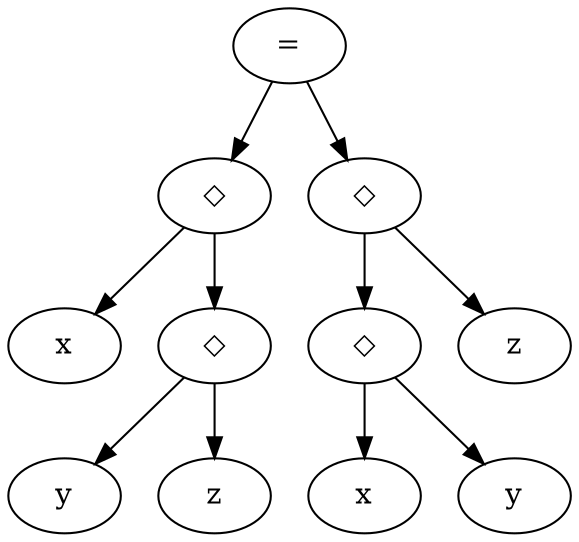

# Candidate representations for the reconstruction experiment

For the experiment that hands a model **one representation of an ETP law** and
asks for **the formal equation back** — the generalization of
[`nl_test/`](nl_test/README.md) from prose to every other rendering.

Running example throughout: **Equation 4512**, `x ◇ (y ◇ z) = (x ◇ y) ◇ z`.

## Status

Eleven of the fifteen are built and verified, one directory each, all
deterministic and round-trip checked over the full 4694:

| item | directory | item | directory |
| --- | --- | --- | --- |
| 1 SSA | [`ssa/`](ssa/) | 6 SMT-LIB | [`smtlib/`](smtlib/) |
| 2 positional slots | [`slots/`](slots/) | 8 indented tree | [`ascii_tree/`](ascii_tree/) |
| 3 reverse Polish | [`rpn/`](rpn/) | 9 DOT graph | [`graphviz/`](graphviz/) |
| 4 Polish prefix | [`polish/`](polish/) | 11 JSON AST | [`json_ast/`](json_ast/) |
| 5 TPTP | [`tptp/`](tptp/) | 12 confusable names | [`confusable_vars/`](confusable_vars/) |
| 13 word problem | [`word_problem/`](word_problem/) | | |

Not built: 7 (oriented rewrite rule), 10 (rendered image), 14 (other-language
text), 15 (the parenthesis-free diagnostic).

## The constraint that shapes this list

`nl_test` does not grade by string match. It hands the reconstruction to the
semantic oracle and gets back `equivalent` / `weaker` / `stronger` /
`incomparable` / `unknown`. Two consequences for choosing representations:

1. **A representation may be lossy and still be measurable.** If a rendering
   drops information, the model's answer lands as `weaker` or `incomparable`
   rather than merely "wrong", and *the direction of the error is the result*.
   That admits probes an exact-match harness would have to throw away.
2. **Variable names and orientation are free.** The oracle normalizes both, so a
   representation may rename variables or flip the sides without penalty. Only
   the *shape* and the *co-reference pattern* have to survive.

A practical corollary: wherever recovery depends on a convention — argument
order in a graph, how slots are numbered, the arity of a postfix operator — the
prompt must state that convention. Otherwise the task is under-determined in
the boring way rather than the interesting one.

## What is already covered

| directory | rendering of Equation 4512 | axis it occupies |
|---|---|---|
| [`latex/`](latex/) | `x \diamond (y \diamond z) = (x \diamond y) \diamond z` | symbolic infix, typeset |
| [`lean/`](lean/) | `∀ x y z : G, x ◇ (y ◇ z) = (x ◇ y) ◇ z` | proof assistant, typed, explicit ∀ |
| [`py_lambda/`](py_lambda/) | `lambda op, x, y, z: op(x, op(y, z)) == op(op(x, y), z)` | executable, intensional |
| [`py_cayley_table/`](py_cayley_table/) | `all(table[x][table[y][z]] == …)` | executable, **extensional** (finite models) |
| [`text/`](text/) | `x diamond open bracket y diamond z close bracket equals …` | mechanical English, delimiters |
| [`text2/`](text2/) | `the diamond of x and the diamond of y and z equals …` | mechanical English, arity |
| [`nl/`](nl/) | model-written prose | fluent English, lossy |

Every one of them is a **linear string of named variables with an explicit
operator symbol**. That is the shared assumption the list below attacks.

## Group 1 — Structure carried without names or delimiters

These four are the highest-value additions: each removes exactly one cue the
existing seven all provide, and all four are pure AST walks, so each reuses the
`text/` scaffolding (translator + `build_catalogue.py` + round-trip check).

### 1. SSA / let-bound flat form — *removes nesting entirely*

```
t1 = y ◇ z
t2 = x ◇ t1
t3 = x ◇ y
t4 = t3 ◇ z
assert t2 = t4
```

Tree depth becomes data flow across independent lines. Nothing is nested, so a
model cannot lean on bracket matching; it has to rebuild the tree from
def-use edges. Exactly invertible. The single cleanest probe of "does it track
structure, or just balance parentheses?"

### 2. Positional slot encoding — *removes variable names*

```
[[1, [2, 3]], [[1, 2], 3]]        (slots numbered by first appearance)
```

Variables become integers, the operator disappears into list nesting, and the
only surviving information is co-reference. Isolates "which occurrences are the
same variable" from "what is it called". Compare Equation 8 (`x = x ◇ (x ◇ x)`),
which becomes `[1, [1, [1, 1]]]` — nothing but shape and sharing.

### 3. Reverse Polish / stack program — *structure via evaluation order*

```
x y z ◇ ◇ x y ◇ z ◇ =
```

or spelled out as a machine, which is the more interesting variant:

```
PUSH x; PUSH y; PUSH z; OP; OP; PUSH x; PUSH y; OP; PUSH z; OP; EQ
```

No delimiters and no arity words — recovery requires simulating a stack.
Failure here is legible in a way it is not elsewhere: a model that mis-pops
produces a specific wrong tree rather than noise.

### 4. Polish prefix, symbols only — *the minimal linear form*

```
= ◇ x ◇ y z ◇ ◇ x y z
```

The bare-metal control: same information as `text2/`'s `the diamond of … and …`
with every word of scaffolding stripped out. Pairing the two isolates how much
of `text2/`'s legibility came from the English words rather than the prefix
order.

## Group 2 — Machine-checkable specification languages

On-mission for the fellowship's Specification Validation and vericoding focus:
these are the formats a real spec pipeline would actually contain.

### 5. TPTP / FOF — *the ATP-native dialect*

```
fof(law4512, axiom, ![X,Y,Z] : op(X, op(Y,Z)) = op(op(X,Y), Z)).
```

The strongest single addition in this group, because the project's own ground
truth came out of Vampire, which eats exactly this. It is also the format most
likely to be dense in pretraining data for the *wrong* reason — plenty of TPTP
problem files are famous — so it doubles as a contamination probe.

### 6. SMT-LIB 2 — *sorted first-order, fully parenthesized*

```smt
(declare-sort M 0)
(declare-fun op (M M) M)
(assert (forall ((x M) (y M) (z M))
  (= (op x (op y z)) (op (op x y) z))))
```

Adds a sort declaration and an explicit quantifier block — more ceremony
around the same term. Tests whether boilerplate dilutes the signal.

### 7. Oriented rewrite rule — *probes the symmetry of `=`*

```
rl [law4512] : X ◇ (Y ◇ Z) => (X ◇ Y) ◇ Z .
```

An equation written as a directed rule. The law is symmetric; the notation
suggests it is not. Does the model hand back an equation, or something it
believes only runs one way? Because the oracle normalizes orientation, a
correct answer grades `equivalent` and a directional misreading shows up as a
distinct, interpretable failure.

## Group 3 — Off the line: other dimensions and other modalities

### 8. Indented syntax tree — *two-dimensional structure*

```
=
├── ◇
│   ├── x
│   └── ◇
│       ├── y
│       └── z
└── ◇
    ├── ◇
    │   ├── x
    │   └── y
    └── z
```

Structure carried by indentation and box-drawing glyphs instead of by any
token. Exactly invertible, trivially generated.

### 9. Graph source (DOT / Mermaid) — *explicit nodes and edges*



The tree as an unordered edge list, where left-versus-right survives only as a
stated convention (first edge is the left argument). That makes argument order
a separate, individually observable failure — worth having, since swapping
arguments is the error the magma's non-commutativity punishes hardest.

### 10. Rendered image of the typeset law — *a genuine modality change*

A PNG of `x ◇ (y ◇ z) = (x ◇ y) ◇ z`, produced from the existing
[`latex/`](latex/) output (`build_catalogue.py --tex` already emits a
compilable document). The only item here that changes the channel rather than
the encoding, and the only one that needs a vision model. Cheap to build,
because the hard half already exists.

### 11. JSON syntax tree — *inert data rather than code*

```json
{"=": [{"◇": ["x", {"◇": ["y", "z"]}]},
       {"◇": [{"◇": ["x", "y"]}, "z"]}]}
```

The same tree `py_lambda/` expresses as executable code, expressed as data with
no evaluation story. Separates "reads a nested structure" from "simulates a
program".

## Group 4 — Framing and robustness probes

These deliberately vary something that *should not* matter. Flat results are a
real finding; degradation is a more interesting one.

### 12. Adversarial variable names — *name noise against structure*

```
l ◇ (I ◇ l1) = (l ◇ I) ◇ l1                                   (confusable)
antecedent ◇ (mediator ◇ consequent) = (antecedent ◇ mediator) ◇ consequent   (verbose)
```

Since the oracle renames variables anyway, only structural recovery is being
scored — so any drop is attributable to the names alone. Directly serves the
adversarial-robustness focus area.

### 13. Word problem — *the same law wearing a story*

```
A workshop welder takes two parts, in order, and fuses them into one.
Claim: for any parts x, y and z, fusing x with the part made by fusing y and z
gives the same part as fusing the part made by fusing x and y with z.
```

Probes whether narrative dressing degrades recovery, and whether a familiar law
is recognised faster once it stops looking like algebra. Needs a model or a
template to generate; a template keeps it deterministic and is enough.

### 14. Mechanical text in another language — *meaning across languages*

```
x losange parenthèse ouvrante y losange z parenthèse fermante égale
parenthèse ouvrante x losange y parenthèse fermante losange z
```

Nearly free: `text/` and `text2/` are word-substitution schemes, so a second
language is a new word table and nothing else — and it stays fully
deterministic and round-trip checkable, which a translated `nl/` would not.

## A diagnostic, not a translation task

### 15. Parenthesis-free (deliberately ambiguous)

```
x = x ◇ x ◇ x
```

The ambiguous rendering of Equation 8. Both readings are real catalogue laws —
`x = x ◇ (x ◇ x)` and `x = (x ◇ x) ◇ x` — so there is no correct answer, and
the measurement is **which way models default to associating** an operation
they have been told is not associative. Report it separately from the
reconstruction accuracies; it answers a different question. (Note that this
probe degenerates on Equation 4512 specifically, where both sides collapse to
the same token sequence — pick laws where the two parses differ.)

## Suggested order

Build **1, 2, 5, 8** first. They are mutually orthogonal — kill nesting, kill
names, change the formal dialect, change the dimensionality — all four are
deterministic and exactly invertible, and all four are AST walks that reuse the
`text/` scaffolding, so each is small. Together with the seven existing
renderings that is an 11-way comparison on the same 4694 laws.

Then **3, 7, 10** for the second wave: a stack machine, a symmetry probe, and a
modality change. Group 4 last — the robustness probes are most informative once
there is a baseline to degrade from.

## Considered and set aside

- **Coq / Isabelle / Agda.** Another proof assistant is a dialect swap on
  [`lean/`](lean/), not a new axis. Worth adding only to measure
  *within*-family variance.
- **Inferring the law from a finite model.** Give a small magma and ask which
  law it satisfies: badly under-determined — many laws hold on any small
  carrier — so it measures inductive guessing rather than meaning preservation.
  [`py_cayley_table/`](py_cayley_table/) already occupies the extensional slot
  in the direction that stays well-posed.
- **Alloy / TLA+ / Dafny.** Real spec languages, but for a bare equational law
  they reduce to Group 2 with heavier boilerplate. Add one only if the
  boilerplate itself is the object of study.
- **Verse or other stylized prose.** High surface distance, but not separable
  from `nl/` as a measurement, and not deterministically generable.
